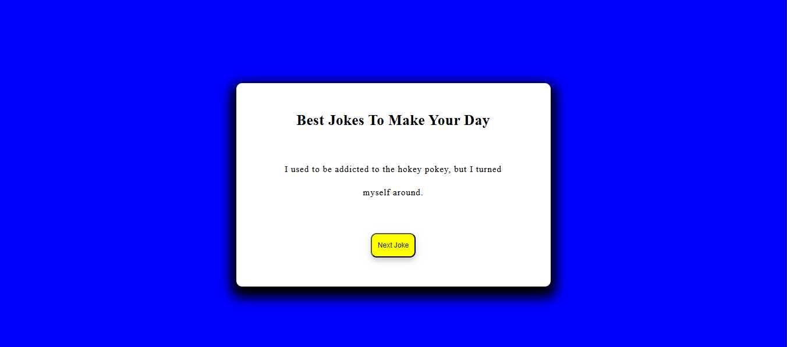

# random-joke-webapp
 This project is a Joke Generator that fetches random jokes from an external API. Users can generate a new joke by clicking the Next Joke button. It's a fun and interactive way to get a laugh with every click!

# 🌟 Features :

1. Fetches random jokes from an external API.

2. Displays jokes dynamically on the webpage.

3. Simple and interactive UI.

4. Button to load the next joke instantly

# 📸 Screenshots :


# 🛠️ Technologies Used :

1. HTML for structure.

2. CSS for styling.

3. JavaScript for API calls and interactivity.

# 🚀 Getting Started 

1. **Clone the repository** :
   ```bash
   git clone https://github.com/yashsri2802/random-joke-webapp.git

2. **Navigate to the project folder** :
   ```bash
   cd random-joke-webapp

3. **Open index.html in your browser.**
   
4. **Click the 'Next Joke' button to fetch and display a new joke.**

# 🔮 Future Enhancements :

1. Add different joke categories (e.g., programming jokes, dad jokes, etc.).

2. Improve UI with animations and styling.

3. Allow users to copy or share jokes easily.

# 🤝 Contributing :

Contributions are welcome! Feel free to fork the repository and submit a pull request with improvements.

# 📌 License :

This project is licensed under the MIT License.
